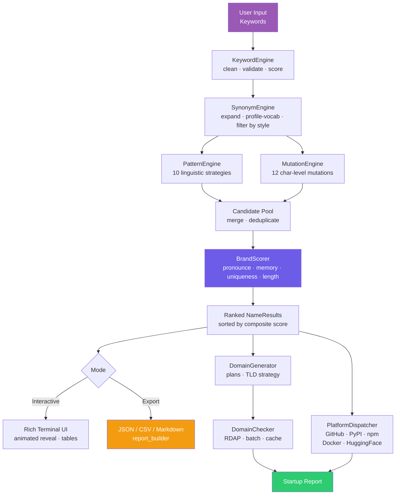

<div align="center">

```
███╗   ██╗███████╗██╗  ██╗ █████╗  ██████╗ ███████╗███╗   ██╗
████╗  ██║██╔════╝╚██╗██╔╝██╔══██╗██╔════╝ ██╔════╝████╗  ██║
██╔██╗ ██║█████╗   ╚███╔╝ ███████║██║  ███╗█████╗  ██╔██╗ ██║
██║╚██╗██║██╔══╝   ██╔██╗ ██╔══██║██║   ██║██╔══╝  ██║╚██╗██║
██║ ╚████║███████╗██╔╝ ██╗██║  ██║╚██████╔╝███████╗██║ ╚████║
╚═╝  ╚═══╝╚══════╝╚═╝  ╚═╝╚═╝  ╚═╝ ╚═════╝ ╚══════╝╚═╝  ╚═══╝
```

**Platform Naming Intelligence Engine**

[](https://python.org)
[](https://github.com/cyberempirex/nexagen)
[](LICENSE)
[](https://github.com/cyberempirex/nexagen)
[](https://github.com/cyberempirex/nexagen)
[](https://github.com/cyberempirex)

*Generate · Analyze · Validate · Discover*

</div>

---

## What Is This

NEXAGEN is a command-line tool that generates and scores brand names for startups, products, platforms, and open-source projects. You give it a few keywords describing what you're building — it runs those through a five-stage linguistic pipeline and hands back ranked candidates with brand strength scores, trademark risk assessments, domain availability across 40+ TLDs, and handle checks on GitHub, PyPI, npm, Docker Hub, and Hugging Face.

It was built for people who spend too much time staring at a blank domain search page. The output isn't random — every name goes through phonetic analysis, memorability scoring, uniqueness testing against a curated blacklist, and collision detection against known trademarks before it surfaces in the results.

---

## Table of Contents

- [Features](#features)
- [Architecture](#architecture)
- [Installation](#installation)
- [Quick Start](#quick-start)
- [CLI Reference](#cli-reference)
- [Menu Modes](#menu-modes)
- [Generation Pipeline](#generation-pipeline)
- [Scoring System](#scoring-system)
- [Profiles & Style Modes](#profiles--style-modes)
- [Domain Intelligence](#domain-intelligence)
- [Platform Checks](#platform-checks)
- [Export Formats](#export-formats)
- [Configuration](#configuration)
- [Environment Variables](#environment-variables)
- [Project Structure](#project-structure)
- [Running Tests](#running-tests)
- [Credits](#credits)

---

## Features

| Capability | Detail |
|---|---|
| **Name Generation** | 5-stage pipeline — keyword processing → synonym expansion → 10 pattern strategies → 12 mutation strategies → brand scoring |
| **Brand Scoring** | Composite 0–100 score across pronounceability, memorability, uniqueness, and length fitness |
| **Phonetic Analysis** | 9-dimension phonetic profile — vowel balance, consonant flow, alternation, syllable rhythm, and more |
| **Collision Detection** | Exact, edit-distance, phonetic (Soundex + Metaphone), substring, and N-gram signals |
| **Trademark Risk** | Damerau-Levenshtein distance against a curated brand blacklist with HIGH / MEDIUM / LOW / NONE tiers |
| **Domain Availability** | RDAP lookup for 40+ scored TLDs with prefix/suffix variant generation and portfolio recommendations |
| **Platform Checks** | Concurrent availability check on GitHub, PyPI, npm, Docker Hub, and Hugging Face |
| **Startup Report** | Full one-shot report — names + domains + platforms + stats — for a project in a single command |
| **Export** | JSON, CSV (Excel-compatible), and Markdown output, individually or all three at once |
| **Themes** | `cyberpunk` (default), `light`, `mono` — Rich-powered terminal UI with animated boot and name reveal |
| **Profiles** | 9 industry profiles that bias vocabulary, TLD selection, and pattern weights |
| **Style Modes** | 6 linguistic styles that control which mutation and pattern strategies are active |

---

## Architecture



---

## Installation

### Requirements

- Python 3.11 or later
- `rich` (terminal UI)
- Internet connection for domain and platform availability checks (optional — checks can be disabled)

### From Source

```bash
git clone https://github.com/cyberempirex/nexagen
cd nexagen
pip install -e .
```

### Manual (no pip install)

```bash
git clone https://github.com/cyberempirex/nexagen
cd nexagen
pip install rich
python -m nexagen.cli.app
```

### Verify

```bash
nexagen --version
# NEXAGEN v1.0.0  ·  CEX-Nexagen
```

---

## Quick Start

**Launch the interactive menu:**

```bash
nexagen
```

**Generate names immediately from the command line:**

```bash
nexagen --generate ai data platform
nexagen --generate cloud security tools --profile security --count 15
nexagen --generate fintech payment ledger --style futuristic --no-anim
```

**Run headless (no animations, no screen clear — good for piping or scripting):**

```bash
nexagen --generate neural model agent --no-anim --no-clear
```

**Full startup report for a project:**

Once inside the interactive menu, choose option `4 — Startup Report`, enter your project name and keywords, and NEXAGEN will run the complete pipeline and write a report to `~/.nexagen/exports/`.

---

## CLI Reference

```
nexagen [OPTIONS]
```

| Flag | Short | Type | Default | Description |
|---|---|---|---|---|
| `--version` | `-v` | flag | — | Print version and exit |
| `--no-anim` | — | flag | off | Disable all Rich animations |
| `--no-clear` | — | flag | off | Skip screen clear on startup |
| `--no-update-check` | — | flag | off | Skip GitHub update check |
| `--profile` | `-p` | string | from settings | Industry profile (see [Profiles](#profiles--style-modes)) |
| `--style` | — | string | from settings | Naming style mode (see [Style Modes](#profiles--style-modes)) |
| `--count` | `-n` | int | `20` | Number of names to generate (max 200) |
| `--generate` | `-g` | `KEYWORD...` | — | Generate immediately and exit |

**Examples:**

```bash
# 30 names, AI profile, futuristic style, no animation
nexagen -g cloud model -p ai --style futuristic -n 30 --no-anim

# Tech profile, default style, open interactive menu
nexagen -p tech

# Quick check — version only
nexagen -v
```

---

## Menu Modes

When launched without `--generate`, NEXAGEN opens an interactive menu:

```
  1  Generate Names      ·  keyword-driven name generation
  2  Analyze Brand       ·  score an existing or custom name
  3  Domain Suggest      ·  TLD strategy + availability for a brand
  4  Startup Report      ·  full pipeline — names + domains + platforms
  5  About               ·  version, credits, system info
  6  Exit
```

---

## Generation Pipeline

Every run — interactive or headless — passes through the same five stages:

```
Stage 1  KeywordEngine
         ─────────────────────────────────────────────────────
         Normalise → validate → score → profile-boost
         Rejects: too-short tokens, digits-only, stopwords
         Output: KeywordSet with final[], scored[], warnings[]

Stage 2  SynonymEngine
         ─────────────────────────────────────────────────────
         Synonym graph expansion (depth-1) + profile vocabulary
         Phonetic deduplication via Soundex + Metaphone
         Output: ExpansionResult — up to 80 scored seed words

Stage 3  PatternEngine   (10 strategies)
         ─────────────────────────────────────────────────────
         direct · prefix · suffix · compound · blend
         mutation · power_ending · soft_ending · truncate · acronym
         Output: GenerationResult — up to 500 candidates

Stage 4  MutationEngine  (12 strategies)
         ─────────────────────────────────────────────────────
         vowel_drop · vowel_replace · consonant_swap · phoneme_sub
         power_ending · soft_ending · letter_double · syllable_drop
         initial_shift · x_infusion · reverse_blend · compress
         Active set is gated by the active StyleMode
         Output: MutationResult — up to 300 additional variants

Stage 5  BrandScorer
         ─────────────────────────────────────────────────────
         Merge both pools → Levenshtein dedup (threshold 2)
         Score every candidate → sort → trim to cfg.count
         Output: list[NameResult] sorted by composite score DESC
```

---

## Scoring System

Each name is scored across four independent dimensions then combined into a single 0–100 composite.

| Dimension | Weight | What It Measures |
|---|---|---|
| **Pronounceability** | 30% | Vowel ratio, consonant run length, alternation score, forbidden phoneme sequences, syllable count |
| **Memorability** | 30% | Length in ideal range (4–8 chars), strong opening consonant, ends on vowel, alliteration, syllable rhythm |
| **Uniqueness** | 20% | Distance from common English words, blacklist proximity, pool distance, phonetic distance, visual novelty |
| **Length Fitness** | 20% | Penalises names shorter than 4 or longer than 8 chars; hard clamp at 2–20 |

**Tier thresholds:**

| Score | Tier | Indicator |
|---|---|---|
| 90–100 | `PREMIUM` | ◆ |
| 75–89 | `STRONG` | ▲ |
| 60–74 | `DECENT` | ● |
| 40–59 | `WEAK` | ▼ |
| 0–39 | `POOR` | ✕ |

**Trademark risk levels** (Damerau-Levenshtein distance against brand blacklist):

| Distance | Risk |
|---|---|
| 0 or ≤ 1 | `HIGH` |
| 2 | `MEDIUM` |
| 3 | `LOW` |
| > 3 | `NONE` |

---

## Profiles & Style Modes

### Profiles

Set with `--profile` or inside settings. Biases vocabulary selection, TLD priority, and pattern weights toward the chosen industry.

| Profile | Best For |
|---|---|
| `tech` | Dev tools, SaaS, infrastructure, cloud platforms |
| `ai` | ML models, AI agents, data pipelines, LLM products |
| `security` | Cybersecurity tools, pentest utilities, threat intelligence |
| `finance` | Fintech, payment rails, trading platforms, DeFi |
| `health` | MedTech, wellness apps, clinical platforms |
| `social` | Communities, creator tools, messaging platforms |
| `education` | EdTech, learning platforms, research tools |
| `document` | Productivity, note-taking, document management |
| `generic` | General purpose — no domain bias |

### Style Modes

Set with `--style`. Controls which mutation strategies and pattern weights are active.

| Style | Character | Active Mutations |
|---|---|---|
| `minimal` | Clean, short, modern | vowel_drop · compress · syllable_drop |
| `futuristic` | Edgy, tech-forward | power_ending · x_infusion · phoneme_sub · consonant_swap |
| `aggressive` | Bold, sharp | power_ending · consonant_swap · initial_shift · letter_double |
| `soft` | Friendly, approachable | soft_ending · vowel_replace · vowel_drop |
| `technical` | Precise, systematic | phoneme_sub · compress · power_ending · syllable_drop |
| `luxury` | Premium, refined | vowel_replace · soft_ending · compress |

---

## Domain Intelligence

### TLD Scoring

40+ TLDs are scored from 0–100 based on recognition, trust, SEO friendliness, and registrar availability. Scores are further adjusted per profile (e.g., `.ai` ranks higher under the `ai` profile).

| TLD | Score | Tier |
|---|---|---|
| `.com` | 100 | PREMIUM |
| `.io` | 85 | PREMIUM |
| `.ai` | 82 | PREMIUM |
| `.co` | 78 | STRONG |
| `.dev` | 74 | STRONG |
| `.app` | 70 | STRONG |
| `.tech` | 68 | STRONG |
| `.cloud` | 65 | STANDARD |
| `.build` | 62 | STANDARD |
| `.tools` | 60 | STANDARD |
| `.net` | 54 | STANDARD |
| `.xyz` | 32 | NICHE |

### Variant Generation

For each brand name, NEXAGEN generates:

1. **Exact** — `brand.com`, `brand.io`, `brand.ai`, …
2. **Prefix** — `getbrand.io`, `usebrand.dev`, `trybrand.app`, …
3. **Suffix** — `brandhub.io`, `brandlab.dev`, `brandapp.co`, …

All variants are checked via RDAP (rdap.org) with an in-process cache (TTL: 1 hour by default) and 12-worker concurrent batch checking.

### Portfolio Recommendations

The `TLDStrategy` module provides `must-have`, `nice-to-have`, and `optional` TLD portfolios per profile — so you know which registrations actually matter beyond `.com`.

---

## Platform Checks

Availability is checked concurrently across five platforms with a configurable timeout (default: 8 seconds per check, 12 workers).

| Platform | What's Checked | Toggle |
|---|---|---|
| GitHub | Username / organisation availability | `check_github` |
| PyPI | Package name availability | `check_pypi` |
| npm | Package name availability | `check_npm` |
| Docker Hub | Namespace availability | `check_docker` |
| Hugging Face | Model / org namespace | `check_huggingface` |

Each check returns `free`, `taken`, or `unknown`. Results are included in the startup report and displayed in a Rich availability table.

---

## Export Formats

Results can be exported individually or all at once (`--export all` from within the CLI, or via `cmd_export()`).

```
~/.nexagen/exports/
  nexagen_export_20250315_142301.json
  nexagen_export_20250315_142301.csv
  nexagen_export_20250315_142301.md
```

### JSON

Structured envelope with `nexagen_export`, `version`, `author`, `exported_at`, `count`, and a `data` array. Report exports include named sections: `metadata`, `names`, `domains`, `platforms`.

### CSV

Multi-section CSV with a metadata header. Supports UTF-8 BOM for Excel compatibility. Each data type (names, analysis, domains, platforms) has its own column schema. Nested fields (domains dict, keywords list) are flattened to readable single-cell strings.

### Markdown

GitHub-Flavored Markdown with pipe tables, Unicode score bars (`▓░`), tier emoji, and availability icons (✔/✘). Report documents include H1 project title, section headers, session stats, and a full NEXAGEN attribution footer. Ready to paste into a project wiki or `NAMING.md`.

---

## Configuration

Settings are stored at `~/.nexagen/settings.toml` and created automatically on first run. They can be edited directly or updated programmatically.

**Key settings:**

```toml
profile          = "generic"     # tech · ai · security · finance · health · social · education · document · generic
style_mode       = "minimal"     # minimal · futuristic · aggressive · soft · technical · luxury
count            = 20            # names to generate per run (5–200)
min_len          = 4             # minimum name length
max_len          = 8             # maximum name length (ideal range — hard max is 20)
use_prefixes     = true
use_suffixes     = true
use_synonyms     = true
do_domain_checks = true
do_handle_checks = true
check_workers    = 12
check_timeout    = 8.0
preferred_tlds   = ["com", "io", "ai", "co", "dev"]
color_theme      = "cyberpunk"   # cyberpunk · light · mono
animations       = true
```

**Score weights** (must sum to 1.0):

```toml
[score_weights]
pronounce    = 0.30
memorability = 0.30
uniqueness   = 0.20
length_fit   = 0.20
```

---

## Environment Variables

All settings can be overridden at runtime via environment variables. Useful for CI pipelines, Docker runs, or quick one-off overrides without touching the config file.

| Variable | Maps To | Example |
|---|---|---|
| `NEXAGEN_PROFILE` | `cfg.profile` | `NEXAGEN_PROFILE=ai` |
| `NEXAGEN_STYLE` | `cfg.style_mode` | `NEXAGEN_STYLE=futuristic` |
| `NEXAGEN_COUNT` | `cfg.count` | `NEXAGEN_COUNT=50` |
| `NEXAGEN_NO_CHECKS` | Disable domain + platform checks | `NEXAGEN_NO_CHECKS=1` |
| `NEXAGEN_NO_ANIM` | Disable animations | `NEXAGEN_NO_ANIM=1` |
| `NEXAGEN_EXPORT_DIR` | `cfg.export_dir` | `NEXAGEN_EXPORT_DIR=/tmp/exports` |
| `NEXAGEN_LOG_LEVEL` | `cfg.log_level` | `NEXAGEN_LOG_LEVEL=DEBUG` |

---

## Project Structure

```
nexagen/
│
├── cli/                    Application entry point and command routing
│   ├── app.py              main() · NexagenApp · argparse CLI flags
│   ├── commands.py         cmd_generate_names · cmd_analyze_brand
│   │                       cmd_domain_suggestions · cmd_startup_report · cmd_export
│   ├── menu.py             Interactive menu dispatch loop
│   └── help.py             Help text and usage examples
│
├── engine/                 Name generation pipeline
│   ├── keyword_engine.py   Tokenise · validate · score · KeywordSet
│   ├── synonym_engine.py   Graph expansion · profile vocab · ExpansionResult
│   ├── pattern_engine.py   10 linguistic strategies · GenerationResult
│   ├── mutation_engine.py  12 char-level mutations · MutationResult
│   └── name_generator.py   5-stage orchestrator · NameGenerator
│
├── analysis/               Scoring and analysis layer
│   ├── brand_score.py      BrandScorer · ScoreResult · composite_score()
│   ├── phonetic_analysis.py 9-dimension PhoneticReport · analyse_phonetics()
│   ├── collision_detection.py CollisionReport · 5 collision signals
│   └── uniqueness_score.py UniquenessReport · 5-axis uniqueness scoring
│
├── domains/                Domain intelligence layer
│   ├── domain_generator.py DomainPlan generation · prefix/suffix variants
│   ├── domain_checker.py   RDAP lookup · batch checking · cache
│   ├── domain_ranker.py    Scoring · ranking · filtering · DomainSummary
│   └── tld_strategy.py     TLDTier · TLDStrategy · portfolio recommendations
│
├── checks/                 Platform availability checks
│   ├── github_check.py     GitHub username/org availability
│   ├── pypi_check.py       PyPI package name availability
│   ├── npm_check.py        npm package name availability
│   ├── docker_check.py     Docker Hub namespace availability
│   └── platform_dispatcher.py Concurrent batch check orchestrator
│
├── export/                 Export engine
│   ├── json_export.py      Structured JSON export · JsonResult
│   ├── csv_export.py       Multi-section CSV · Excel-compatible · CsvResult
│   ├── markdown_export.py  GFM tables · score bars · MarkdownResult
│   └── report_builder.py   ReportBuilder · ExportManifest · multi-format output
│
├── ui/                     Terminal UI layer (Rich)
│   ├── theme.py            ThemePalette · cyberpunk/light/mono · apply_theme()
│   ├── banner.py           Animated banner · section dividers · status helpers
│   ├── tables.py           NameResult · AnalysisData · DomainEntry · print_*
│   ├── animations.py       Boot sequence · spinners · name reveal
│   └── progress.py         MultiStepProgress · WorkflowStep · track()
│
├── utils/                  Core utilities (no UI dependencies)
│   ├── levenshtein.py      levenshtein · damerau_levenshtein · jaro_winkler
│   │                       trademark_risk · deduplicate_by_distance
│   ├── text_utils.py       soundex · metaphone · syllable_count · vowel_ratio
│   │                       brand_variants · is_pronounceable · forbidden_sequence_*
│   ├── validators.py       validate_brand_name · validate_domain_name
│   └── dataset_loader.py   Lazy-cached dataset reads for all .txt files
│
├── config/
│   ├── constants.py        All numeric thresholds · colour palette · enums
│   └── settings.py         Settings dataclass · TOML persistence · env overrides
│
├── datasets/               Bundled text datasets (loaded at runtime)
│   ├── synonyms.txt
│   ├── common_words.txt
│   ├── brand_blacklist.txt
│   ├── prefixes.txt        62 domain prefixes
│   ├── suffixes.txt        129 domain suffixes
│   ├── tlds.txt            40 scored TLDs
│   ├── tech_terms.txt
│   ├── ai_terms.txt
│   └── business_terms.txt
│
└── tests/
    ├── test_generation.py  KeywordEngine · SynonymEngine · PatternEngine
    │                       MutationEngine · NameGenerator · levenshtein utils
    ├── test_scoring.py     BrandScorer · PhoneticAnalysis · CollisionDetection
    │                       UniquenessScore · TrademarkRisk · BrandTier mapping
    └── test_domains.py     DomainValidator · DomainRanker · DomainGenerator
                            TLDStrategy · TLDTier · DomainChecker (mocked)
```

---

## Running Tests

```bash
# All tests
python -m pytest tests/ -v

# Individual suites
python -m pytest tests/test_generation.py -v
python -m pytest tests/test_scoring.py -v
python -m pytest tests/test_domains.py -v

# With unittest directly
python -m unittest tests.test_generation -v
python -m unittest tests.test_scoring -v
python -m unittest tests.test_domains -v

# Quick smoke test — no external dependencies
python -m pytest tests/ -v --tb=short -x
```

Tests run entirely offline. All network calls in `test_domains.py` are patched via `unittest.mock` — no real RDAP or DNS requests are made.

---

## Module Stats

| Layer | Files | Lines |
|---|---|---|
| `cli/` | 5 | ~3,465 |
| `ui/` | 6 | ~3,394 |
| `export/` | 5 | ~3,304 |
| `utils/` | 5 | ~3,116 |
| `engine/` | 6 | ~2,833 |
| `analysis/` | 5 | ~2,482 |
| `domains/` | 5 | ~2,460 |
| `checks/` | 6 | ~2,146 |
| `config/` | 3 | ~1,083 |
| **Total** | **51** | **~27,000** |

---

## Credits

**Developed by [CyberEmpireX](https://github.com/cyberempirex)**

CEX-Nexagen is part of the **CyberEmpireX (CEX)** ecosystem — a collection of practical cybersecurity and research tools built for professionals who prefer working from a terminal.

```
Tool     :  NEXAGEN v1.0.0
Author   :  CEX-Nexagen
Ecosystem:  CyberEmpireX (CEX)
Contact  :  contact@cyberempirex.dev
Repo     :  https://github.com/cyberempirex/nexagen
```

---

<div align="center">

*NEXAGEN is provided as-is for research and creative use.*
*Final responsibility for name selection rests with the user.*

**CEX-Nexagen · CyberEmpireX**

</div>
