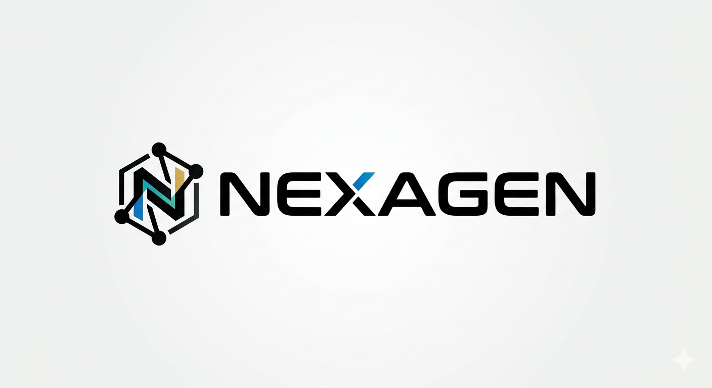
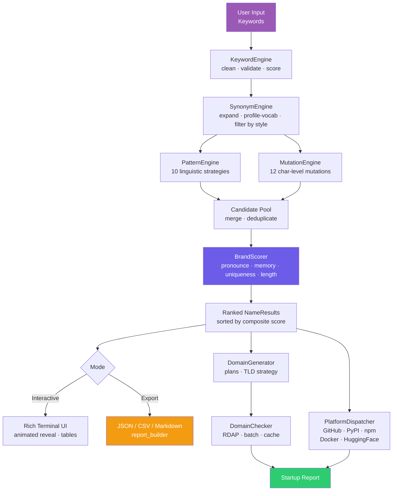

<div align="center">



<br/>

**Platform Naming Intelligence Engine**

<br/>

<!-- Row 1 — Core identity -->
[](https://python.org)
[](https://github.com/cyberempirex/nexagen/releases)
[](LICENSE)
[](https://github.com/cyberempirex/nexagen)

<!-- Row 2 — Project metrics -->
[](https://github.com/cyberempirex/nexagen)
[](https://github.com/cyberempirex/nexagen)
[](tests/)
[](https://github.com/cyberempirex/nexagen/wiki)

<!-- Row 3 — Platform & community -->
[](https://github.com/cyberempirex/nexagen)
[](https://github.com/cyberempirex/nexagen)
[](https://github.com/cyberempirex/nexagen/stargazers)
[](https://github.com/cyberempirex/nexagen/network)
[](https://github.com/cyberempirex/nexagen/issues)
[](https://github.com/cyberempirex/nexagen/commits/main)
[](https://github.com/cyberempirex/nexagen)
[](https://github.com/cyberempirex)

<br/>

*Generate · Analyze · Validate · Discover*

<br/>

> ⭐ **If NEXAGEN saves you time, consider [starring the repo](https://github.com/cyberempirex/nexagen) — it helps others find it.**

</div>

---

## What Is This

NEXAGEN is a command-line tool that generates and scores brand names for startups, products, platforms, and open-source projects. You give it a few keywords describing what you're building — it runs those through a five-stage linguistic pipeline and hands back ranked candidates with brand strength scores, trademark risk assessments, domain availability across 40+ TLDs, and handle checks on GitHub, PyPI, npm, Docker Hub, and Hugging Face.

It was built for people who spend too much time staring at a blank domain search page. The output isn't random — every name goes through phonetic analysis, memorability scoring, uniqueness testing against a curated blacklist, and collision detection against known trademarks before it surfaces in the results.

---

## Table of Contents

- [Features](#features)
- [Architecture](#architecture)
- [Installation](#installation)
- [Quick Start](#quick-start)
- [CLI Reference](#cli-reference)
- [Menu Modes](#menu-modes)
- [Generation Pipeline](#generation-pipeline)
- [Scoring System](#scoring-system)
- [Profiles & Style Modes](#profiles--style-modes)
- [Domain Intelligence](#domain-intelligence)
- [Platform Checks](#platform-checks)
- [Export Formats](#export-formats)
- [Configuration](#configuration)
- [Environment Variables](#environment-variables)
- [Project Structure](#project-structure)
- [Running Tests](#running-tests)
- [Module Stats](#module-stats)
- [Credits](#credits)

---

## Features

| Capability | Detail |
|---|---|
| **Name Generation** | 5-stage pipeline — keyword processing → synonym expansion → 10 pattern strategies → 12 mutation strategies → brand scoring |
| **Brand Scoring** | Composite 0–100 score across pronounceability, memorability, uniqueness, and length fitness |
| **Phonetic Analysis** | 9-dimension phonetic profile — vowel balance, consonant flow, alternation, syllable rhythm, and more |
| **Collision Detection** | Exact, edit-distance, phonetic (Soundex + Metaphone), substring, and N-gram signals |
| **Trademark Risk** | Damerau-Levenshtein distance against a curated brand blacklist with HIGH / MEDIUM / LOW / NONE tiers |
| **Domain Availability** | RDAP lookup for 40+ scored TLDs with prefix/suffix variant generation and portfolio recommendations |
| **Platform Checks** | Concurrent availability check on GitHub, PyPI, npm, Docker Hub, and Hugging Face |
| **Startup Report** | Full one-shot report — names + domains + platforms + stats — for a project in a single command |
| **Export** | JSON, CSV (Excel-compatible), and Markdown output, individually or all three at once |
| **Themes** | `cyberpunk` (default), `light`, `mono` — Rich-powered terminal UI with animated boot and name reveal |
| **Profiles** | 9 industry profiles that bias vocabulary, TLD selection, and pattern weights |
| **Style Modes** | 6 linguistic styles that control which mutation and pattern strategies are active |

---

## Architecture



---

## Installation

### Requirements

- Python 3.9 or later
- `rich >= 13.0` (terminal UI)
- `typer >= 0.9` (CLI framework)
- `httpx >= 0.27` (HTTP client)
- `rapidfuzz >= 3.0` (fuzzy string matching)
- Internet connection for domain and platform availability checks (optional — checks can be disabled)

### From Source

```bash
git clone https://github.com/cyberempirex/nexagen
cd nexagen
pip install -e .
```

### Manual (no pip install)

```bash
git clone https://github.com/cyberempirex/nexagen
cd nexagen
pip install rich typer httpx rapidfuzz
python -m nexagen.cli.app
```

### Verify

```bash
nexagen --version
# NEXAGEN v1.0.0  ·  CEX-Nexagen
```

---

## Quick Start

**Launch the interactive menu:**

```bash
nexagen
```

**Generate names immediately from the command line:**

```bash
nexagen --generate ai data platform
nexagen --generate cloud security tools --profile security --count 15
nexagen --generate fintech payment ledger --style futuristic --no-anim
```

**Run headless (no animations, no screen clear — good for piping or scripting):**

```bash
nexagen --generate neural model agent --no-anim --no-clear
```

**Full startup report for a project:**

Once inside the interactive menu, choose option `4 — Startup Report`, enter your project name and keywords, and NEXAGEN will run the complete pipeline and write a report to `~/.nexagen/exports/`.

---

## CLI Reference

```
nexagen [OPTIONS]
```

| Flag | Short | Type | Default | Description |
|---|---|---|---|---|
| `--version` | `-v` | flag | — | Print version and exit |
| `--no-anim` | — | flag | off | Disable all Rich animations |
| `--no-clear` | — | flag | off | Skip screen clear on startup |
| `--no-update-check` | — | flag | off | Skip GitHub update check |
| `--profile` | `-p` | string | from settings | Industry profile — see [Profiles](#profiles--style-modes) |
| `--style` | — | string | from settings | Naming style mode — see [Style Modes](#profiles--style-modes) |
| `--count` | `-n` | int | `20` | Number of names to generate (max 200) |
| `--generate` | `-g` | `KEYWORD...` | — | Generate immediately and exit |

**Examples:**

```bash
# 30 names, AI profile, futuristic style, no animation
nexagen -g cloud model -p ai --style futuristic -n 30 --no-anim

# Tech profile, default style, open interactive menu
nexagen -p tech

# Quick check — version only
nexagen -v
```

---

## Menu Modes

When launched without `--generate`, NEXAGEN opens an interactive menu:

```
  1  Generate Names      ·  keyword-driven name generation
  2  Analyze Brand       ·  score an existing or custom name
  3  Domain Suggest      ·  TLD strategy + availability for a brand
  4  Startup Report      ·  full pipeline — names + domains + platforms
  5  About               ·  version, credits, system info
  6  Exit
```

---

## Generation Pipeline

Every run — interactive or headless — passes through the same five stages:

```
Stage 1 — KeywordEngine
  Normalise → validate → score → profile-boost
  Rejects: too-short tokens, digits-only, stopwords
  Output: KeywordSet with final[], scored[], warnings[]

Stage 2 — SynonymEngine
  Synonym graph expansion (depth-1) + profile vocabulary injection
  Phonetic deduplication via Soundex + Metaphone
  Output: ExpansionResult — up to 80 scored seed words

Stage 3 — PatternEngine  (10 strategies)
  Applies macro-level combination strategies to the seed pool
  Each candidate carries a strategy tag for filtering and analysis
  Output: list[Candidate] — name + strategy + source seeds

Stage 4 — MutationEngine  (12 strategies)
  Applies character- and phoneme-level mutations to individual seeds
  Works deeper than PatternEngine — modifies within words, not between them
  Output: list[MutatedCandidate] — name + strategy + fitness flag

Stage 5 — BrandScorer
  Merges and deduplicates all candidates from stages 3 and 4
  Scores each on 4 weighted dimensions (see Scoring System)
  Applies quality gate: names scoring below 40 are dropped
  Output: list[NameResult] sorted by composite score descending
```

### Pattern Strategies

| # | Strategy | Example |
|---|---|---|
| 1 | DIRECT | Seeds that already meet length requirements |
| 2 | PREFIX | `get` + seed → `getdata`, `open` + seed → `openflow` |
| 3 | SUFFIX | seed + `hub` → `datahub`, seed + `base` → `flowbase` |
| 4 | COMPOUND | seed + seed → `cloudstream` |
| 5 | BLEND | Portmanteau of two seeds → `nexagen` |
| 6 | MUTATION | Vowel-drop / consonant swap → `datx`, `flwio` |
| 7 | POWER_ENDING | Vowel-stripped seed + power suffix → `-ex`, `-ix`, `-on` |
| 8 | SOFT_ENDING | seed + soft suffix → `-ly`, `-fy`, `-io`, `-al`, `-ara` |
| 9 | TRUNCATE | Shortened form → `datacenter` → `datacen` |
| 10 | ACRONYM | Initials of multi-word seeds → `nexio` |

### Mutation Strategies

| # | Strategy | Example |
|---|---|---|
| 1 | VOWEL_DROP | `data` → `dta` |
| 2 | VOWEL_REPLACE | `nexus` → `noxus` |
| 3 | CONSONANT_SWAP | `kore` → `core` |
| 4 | PHONEME_SUB | `phone` → `fone` |
| 5 | POWER_ENDING | `cloud` → `cloudex` |
| 6 | SOFT_ENDING | `data` → `datalia` |
| 7 | LETTER_DOUBLE | `nova` → `novva` |
| 8 | SYLLABLE_DROP | Remove weakest syllable from long words |
| 9 | INITIAL_SHIFT | `base` → `vase` / `dase` |
| 10 | X_INFUSION | `core` → `xcore` / `corex` |
| 11 | REVERSE_BLEND | `data` + `flow` → `taflow` |
| 12 | COMPRESS | `cloud` → `clud` |

---

## Scoring System

Each candidate is scored on four dimensions and combined into a single composite score from 0 to 100.

| Dimension | Weight | What It Measures |
|---|---|---|
| Pronounceability | 30% | Vowel-consonant balance, alternation, syllable rhythm, cluster complexity |
| Memorability | 30% | Length fitness, phonetic uniqueness, syllable count, pattern regularity |
| Uniqueness | 20% | Distance from common words, blacklist, and known trademarks |
| Length Fitness | 20% | Penalty for names outside the ideal 4–8 character range |

### Score Tiers

| Tier | Score Range | Indicator |
|---|---|---|
| PREMIUM | 90 – 100 | ◆ |
| STRONG | 75 – 89 | ▲ |
| DECENT | 60 – 74 | ● |
| WEAK | 40 – 59 | ▼ |
| POOR | 0 – 39 | ✕ — filtered out before display |

Score weights are configurable in `~/.nexagen/settings.toml` under `[score_weights]`.

---

## Profiles & Style Modes

### Profiles

Profiles bias the synonym vocabulary, preferred TLDs, pattern weights, and blacklist thresholds toward a specific industry vertical.

| Profile | Flag value | Focus |
|---|---|---|
| Generic | `generic` | Balanced defaults — no bias |
| Tech | `tech` | Developer tools, infrastructure |
| AI | `ai` | Machine learning, neural, model |
| Security | `security` | Cyber, defence, zero-trust |
| Finance | `finance` | Fintech, ledger, payments |
| Health | `health` | Medtech, wellness, clinical |
| Social | `social` | Community, network, connect |
| Education | `education` | Learning, courses, knowledge |
| Document | `document` | Docs, notes, productivity |

```bash
nexagen --generate payments ledger --profile finance
nexagen -g model inference serving -p ai
```

### Style Modes

Style modes control which pattern and mutation strategies are enabled and what length preferences are applied.

| Style | Flag value | Character |
|---|---|---|
| Minimal | `minimal` | Short, clean names (4–6 chars); DIRECT, PREFIX, SUFFIX, TRUNCATE |
| Futuristic | `futuristic` | Sci-fi feel; POWER_ENDING, X_INFUSION, PHONEME_SUB, BLEND |
| Aggressive | `aggressive` | Hard, strong names; COMPOUND, POWER_ENDING, INITIAL_SHIFT |
| Soft | `soft` | Vowel endings, approachable; SOFT_ENDING, VOWEL_REPLACE, BLEND |
| Technical | `technical` | Precise, compound; PREFIX, SUFFIX, COMPOUND, ACRONYM |
| Luxury | `luxury` | Short, premium; TRUNCATE, BLEND, POWER_ENDING, VOWEL_REPLACE |

```bash
nexagen --generate cloud deploy --style futuristic
nexagen -g health wellness --profile health --style soft
```

---

## Domain Intelligence

Domain checks use RDAP (the modern replacement for WHOIS) via `rdap.org`. Results are cached locally in `~/.nexagen/cache/domains/` with a 1-hour TTL to avoid redundant network calls.

### TLD Coverage and Scores

TLDs are scored from 1–100 based on perceived brand value and recognition. The score influences how domain results are sorted and recommended.

| Score | TLDs |
|---|---|
| 100 | `.com` |
| 80–85 | `.io`, `.ai` |
| 70–79 | `.co`, `.dev` |
| 60–69 | `.app`, `.tech`, `.cloud` |
| 50–59 | `.build`, `.hub`, `.labs`, `.net` |
| 40–49 | `.tools`, `.run`, `.studio`, `.org`, `.online`, `.health`, `.finance` |
| 20–39 | `.site`, `.digital`, `.works`, `.world`, `.space`, `.xyz`, `.me`, `.ly`, `.gg`, `.so` |

Full list of checked TLDs: `com io ai co dev app tech cloud build tools run systems net org online site digital works world space center group software platform solutions services network hub labs link studio agency design health finance xyz me ly gg so`

### Domain Variants

For each brand name, NEXAGEN generates multiple domain variants before checking:

- Bare name across all preferred TLDs: `nexagen.io`, `nexagen.ai`, etc.
- Prefix variants: `getnexagen.com`, `trynexagen.com`, `usenexagen.com`
- Suffix variants: `nexagenhq.com`, `nexagenlabs.io`, `nexagenapp.co`

### Availability Status

| Icon | Status | Meaning |
|---|---|---|
| ✔ | FREE | Domain is available to register |
| ✘ | TAKEN | Domain is registered (RDAP body confirmed) |
| ? | UNKNOWN | RDAP returned an ambiguous response — re-check manually |

> **Note:** TAKEN requires both an HTTP 200 response **and** a valid RDAP domain object in the body. Some registries incorrectly return HTTP 200 for unregistered domains. NEXAGEN validates the response body against RFC 9083 before declaring a domain TAKEN — missing `objectClassName`, `status`, or domain identifier fields will produce UNKNOWN instead of a false positive.

---

## Platform Checks

Handle availability is checked concurrently across five platforms using their public APIs.

| Platform | API Endpoint | What Is Checked |
|---|---|---|
| GitHub | `api.github.com/users/{handle}` | User or organisation name |
| PyPI | `pypi.org/pypi/{package}/json` | Package name |
| npm | `registry.npmjs.org/{package}` | Package name |
| Docker Hub | `hub.docker.com/v2/users/{name}` | User or organisation name |
| Hugging Face | `huggingface.co/api/users/{name}` | User or organisation name |

All five checks run in parallel. Results are included in the domain table output and in all export formats.

Platform checks can be toggled individually in `~/.nexagen/settings.toml`:

```toml
check_github      = true
check_pypi        = true
check_npm         = true
check_docker      = true
check_huggingface = true
```

---

## Export Formats

NEXAGEN can write results to `~/.nexagen/exports/` in three formats.

| Format | Flag | File | Contents |
|---|---|---|---|
| JSON | `json` | `nexagen_YYYYMMDD_HHMMSS.json` | Full structured report with all scores, domains, platforms, and metadata |
| CSV | `csv` | `nexagen_YYYYMMDD_HHMMSS.csv` | Excel-compatible flat table — one row per name candidate |
| Markdown | `markdown` | `nexagen_YYYYMMDD_HHMMSS.md` | Human-readable report with tables and domain/platform sections |
| All | `all` | All three files | All formats written simultaneously |

Export format is set in settings or triggered from the interactive menu after any generation run.

```toml
# ~/.nexagen/settings.toml
export_format = "all"     # json | csv | markdown | all
auto_export   = false     # write automatically after every run
```

---

## Configuration

Settings are stored in `~/.nexagen/settings.toml` and created automatically on first run. All values have sensible defaults — the file only needs to exist if you want to change something.

```toml
# Generation
profile      = "generic"    # tech | ai | security | finance | health | social | education | document | generic
style_mode   = "minimal"    # minimal | futuristic | aggressive | soft | technical | luxury
count        = 20           # default names to generate (max 200)
min_len      = 4            # minimum name length
max_len      = 8            # maximum name length
use_suffixes = true
use_prefixes = true
use_synonyms = true

# Domain checks
do_domain_checks  = true
do_handle_checks  = true
check_workers     = 12      # parallel workers
check_timeout     = 8.0     # seconds per request
preferred_tlds    = ["com", "io", "ai", "co", "dev"]

# Platform checks
check_github      = true
check_pypi        = true
check_npm         = true
check_docker      = true
check_huggingface = true

# Display
color_theme     = "cyberpunk"   # cyberpunk | light | mono
animations      = true
table_row_limit = 30

# Export
export_format = "json"          # json | csv | markdown | all
auto_export   = false
export_dir    = "~/.nexagen/exports"

# Cache
cache_enabled     = true
cache_ttl_seconds = 3600

# Score weights  (must sum to 1.0)
[score_weights]
pronounce    = 0.30
memorability = 0.30
uniqueness   = 0.20
length_fit   = 0.20
```

---

## Environment Variables

Environment variables override the corresponding settings file values.

| Variable | Type | Default | Description |
|---|---|---|---|
| `NEXAGEN_PROFILE` | string | `generic` | Default industry profile |
| `NEXAGEN_STYLE` | string | `minimal` | Default style mode |
| `NEXAGEN_COUNT` | int | `20` | Default generation count |
| `NEXAGEN_NO_ANIM` | `0`/`1` | `0` | Disable animations globally |
| `NEXAGEN_NO_CLEAR` | `0`/`1` | `0` | Disable screen clear on startup |
| `NEXAGEN_NO_DOMAIN` | `0`/`1` | `0` | Disable domain checks |
| `NEXAGEN_NO_HANDLE` | `0`/`1` | `0` | Disable platform handle checks |
| `NEXAGEN_EXPORT_DIR` | path | `~/.nexagen/exports` | Export output directory |
| `NEXAGEN_CACHE_DIR` | path | `~/.nexagen/cache` | Cache directory |
| `NEXAGEN_LOG_LEVEL` | string | `WARNING` | Logging level: `DEBUG`, `INFO`, `WARNING`, `ERROR` |
| `NEXAGEN_THEME` | string | `cyberpunk` | UI colour theme |

---

## Project Structure

```
nexagen/
├── nexagen/
│   ├── analysis/
│   │   ├── brand_score.py          # Composite scorer — 4-dimension weighted scoring
│   │   ├── collision_detection.py  # Exact, fuzzy, phonetic, substring collision checks
│   │   ├── phonetic_analysis.py    # 9-dimension phonetic profile
│   │   └── uniqueness_score.py     # Blacklist distance and originality scoring
│   ├── checks/
│   │   ├── platform_dispatcher.py  # Unified platform check router
│   │   ├── github_check.py         # GitHub user/org availability
│   │   ├── pypi_check.py           # PyPI package availability
│   │   ├── npm_check.py            # npm package availability
│   │   └── docker_check.py         # Docker Hub availability
│   ├── cli/
│   │   ├── app.py                  # Entry point — CLI argument parsing
│   │   ├── commands.py             # All command implementations
│   │   ├── menu.py                 # Interactive menu loop
│   │   └── help.py                 # Help text and usage strings
│   ├── config/
│   │   ├── constants.py            # All static constants — never changes at runtime
│   │   └── settings.py             # Runtime settings with TOML persistence
│   ├── datasets/
│   │   ├── synonyms.txt            # Synonym graph
│   │   ├── tech_terms.txt          # Tech vocabulary
│   │   ├── ai_terms.txt            # AI/ML vocabulary
│   │   ├── business_terms.txt      # Business vocabulary
│   │   ├── common_words.txt        # Common word filter list
│   │   ├── brand_blacklist.txt     # Trademark collision list
│   │   ├── prefixes.txt            # Brand prefix list
│   │   ├── suffixes.txt            # Brand suffix list
│   │   └── tlds.txt                # Full TLD list with scores
│   ├── domains/
│   │   ├── domain_checker.py       # RDAP availability checking with body validation
│   │   ├── domain_generator.py     # Domain variant generation (prefix/suffix/bare)
│   │   ├── domain_ranker.py        # TLD scoring and portfolio recommendations
│   │   └── tld_strategy.py         # TLD selection strategy by profile
│   ├── engine/
│   │   ├── keyword_engine.py       # Stage 1 — keyword normalisation and scoring
│   │   ├── synonym_engine.py       # Stage 2 — synonym expansion and deduplication
│   │   ├── pattern_engine.py       # Stage 3 — 10 macro-level pattern strategies
│   │   ├── mutation_engine.py      # Stage 4 — 12 character-level mutation strategies
│   │   └── name_generator.py       # Stage 5 — orchestrates pipeline, scores, ranks
│   ├── export/
│   │   ├── report_builder.py       # Report assembly and multi-format dispatch
│   │   ├── json_export.py          # JSON export writer
│   │   ├── csv_export.py           # CSV export writer
│   │   └── markdown_export.py      # Markdown report writer
│   ├── ui/
│   │   ├── animations.py           # Rich-powered spinners, boot sequence, reveal
│   │   ├── banner.py               # Section headers, logo, about screen
│   │   ├── progress.py             # DomainCheckProgress, GenerationProgress
│   │   ├── tables.py               # Results tables — names, domains, platforms
│   │   └── theme.py                # Colour theme definitions
│   └── utils/
│       ├── dataset_loader.py       # Dataset file loading with caching
│       ├── levenshtein.py          # Damerau-Levenshtein implementation
│       ├── text_utils.py           # String helpers — blend, truncate, phonetic
│       └── validators.py           # Input validation helpers
├── tests/
│   ├── test_generation.py          # Generation pipeline tests
│   ├── test_scoring.py             # Brand scorer tests
│   └── test_domains.py             # Domain checker tests
├── docs/
│   ├── architecture.md             # Layer diagram and design decisions
│   └── usage.md                    # Extended usage guide
├── assets/
│   └── nexagen-logo.png
├── pyproject.toml
├── setup.cfg
├── LICENSE
└── README.md
```

---

## Running Tests

```bash
# Install dev dependencies
pip install -e ".[dev]"

# Run all tests
pytest

# Run with coverage report
pytest --cov=nexagen --cov-report=term-missing

# Run a specific module
pytest tests/test_generation.py
pytest tests/test_scoring.py
pytest tests/test_domains.py

# Run only fast tests (skip network checks)
pytest -m "not network"
```

---

## Module Stats

| Module | Lines | Responsibility |
|---|---|---|
| `cli/commands.py` | ~1,330 | All command implementations |
| `engine/pattern_engine.py` | ~750 | 10 pattern generation strategies |
| `ui/banner.py` | ~730 | Logo, sections, about screen |
| `ui/animations.py` | ~695 | Spinners, boot sequence, reveal |
| `engine/mutation_engine.py` | ~680 | 12 mutation strategies |
| `ui/progress.py` | ~650 | Progress bars and check trackers |
| `domains/domain_checker.py` | ~654 | RDAP checks and cache |
| `domains/tld_strategy.py` | ~717 | TLD strategy by profile |
| `config/constants.py` | ~600 | All static constants |
| `analysis/brand_score.py` | ~580 | 4-dimension composite scorer |
| `engine/name_generator.py` | ~560 | Pipeline orchestration |
| `domains/domain_generator.py` | ~551 | Domain variant generation |
| `analysis/collision_detection.py` | ~540 | Collision signal detection |
| `domains/domain_ranker.py` | ~541 | TLD scoring and ranking |
| `ui/tables.py` | ~731 | Results table rendering |

---

## Credits

**NEXAGEN** is a project by [CyberEmpireX (CEX)](https://github.com/cyberempirex), part of the CEX ecosystem.

- Community: [t.me/CyberEmpireXChat](https://t.me/CyberEmpireXChat)
- Issues & feature requests: [github.com/cyberempirex/nexagen/issues](https://github.com/cyberempirex/nexagen/issues)
- Documentation: [docs/usage.md](docs/usage.md)

NEXAGEN is provided as-is for research and creative use. Final responsibility for name selection, trademark clearance, and domain registration lies with the user.

---

<div align="center">

*Built by [CyberEmpireX](https://github.com/cyberempirex) · MIT License · v1.0.0*

</div>
